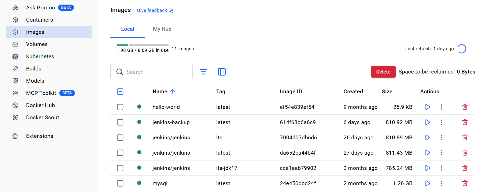

# Docker Setup and Installation
## Objective
The objective of this practicals session was to successfully install Docker in my system, verify the installation, and have a working Docker environment to create and manage containers.

## What I Did in Class
- During the classroom practical, the tutor introduced us to the process of installation step by step. First, the installation process was shown on the computer of the teacher through the projector.

- It was mentioned that Docker could be installed on Windows, Mac, and Linux operating systems, but the procedures for doing so were a little bit different depending on the OS.

## Installation on Windows 
- My laptop runs Windows 11, so I followed the Windows installation steps as demonstrated in class.
**Step 1:** Downloading Docker Desktop
-using this link : https://www.docker.com/products/docker-desktop/

**Step 2:** Running the Installer
- Once the download was complete, I was instructed to locate the downloaded file (Docker Desktop Installer.exe) in my Downloads folder.
- I was told to right click on the installer and select "Run as administrator" . The teacher explained that this is important because Docker needs administrative privileges to install properly.
- I followed the instruction and ran the installer as administrator.

##### During this time, the teacher explained what was being installed:
- Docker Engine
- Docker CLI
- Docker Compose
- Docker Desktop GUI

**Step 6:** Launching Docker Desktop

