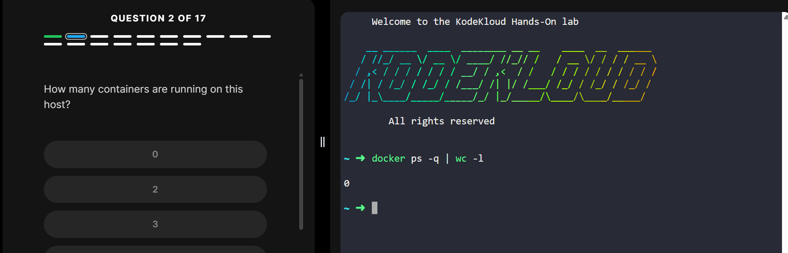
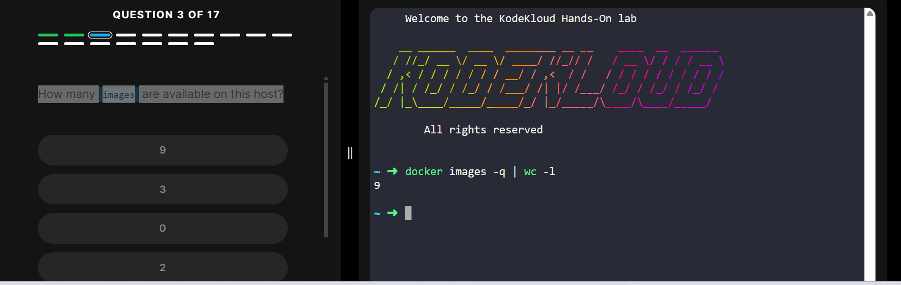
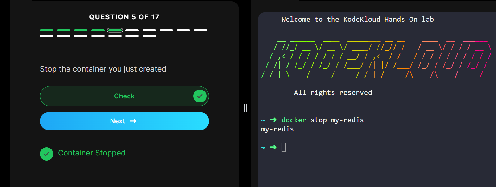

# Docker Basic Commands Lab Report Kodekloud

# Introduction
- The objectives of this lab included assisting me to learn the basic Docker command line operations. In the course of the exercises, I downloaded Docker images, created containers, managed containers, and deleted Docker resources that were not in use.

- The primary objective of the lab was to enable me to gain hands-on experience with managing Docker containers and understand how Docker makes it easier to deploy applications.

# Objectives
- To comprehend the fundamentals of Docker containers and images.
- To get an understanding on pulling Docker images from Docker hub.
- To gain knowledge about creation and management of Docker containers.
- To learn the process of starting, stopping and removing containers.
- To comprehend the procedure of removal of Docker images.
- To gain practical skills of executing Docker commands on a Linux machine.

## Lab Tasks and Commands
Task 1: Pull Docker Image
- The first step involved downloading the nginx:1.14-alpine Docker image from Docker Hub.
**Command Used**
- docker pull nginx:1.14-alpine

## Task 2: Run Docker Container
- The next step was to set up and start the container named webapp using the downloaded image.

## Task 3: Listing All Containers
- To view all containers (running + stopped):

## Task4: Stopping a Container
- To stop a running container:

## Task5: Removing a Container
1. List all containers (running + stopped)
- docker ps -a

2. Remove a specific container
- docker rm a1b2c3d4e5f6

## Task6: Removing Docker Images
1. List all images
- docker images

2. Remove a specific image
- docker rmi ubuntu

## Challenges Encountered
- There were some challenges I had during the experiment, which included:
1. Confusion in container ID when multiple containers were running simultaneously.
2. Forgetting to stop the containers before deleting the image.
3. Distinguishing image from container.
4. Trying to delete the running containers.

## What I Learned
- From this lab, I have learned:
1. How Docker pulls and executes the image automatically.
2. The distinction between containers and images.
3. Container management through CLI commands.
4. Resource cleanup of Docker.
5. Checking the status of containers before deleting them.
6. Moreover, I came to know about the usefulness of Docker for application deployment in isolated environments.

## Conclusion
- This experiment has provided me with practical experience on Docker concepts. I feel very comfortable using the basic Docker commands when managing containers and images. The ability to use these commands is very necessary in DevOps, cloud computing, and software distribution.

- In general, this experiment has enhanced my knowledge and skills in containerization and Docker.