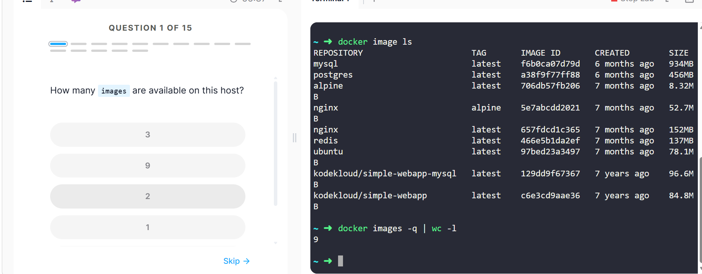
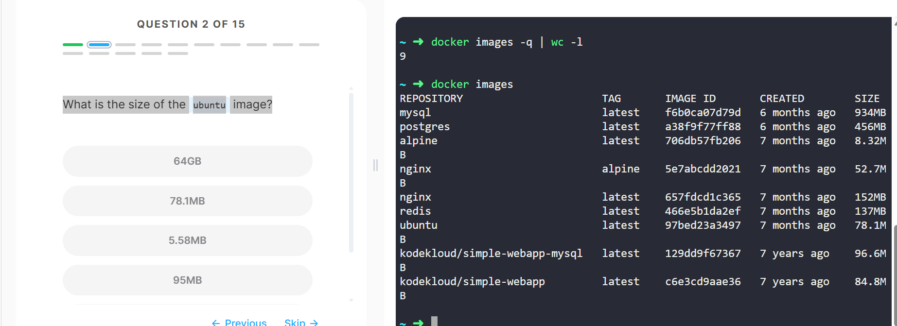
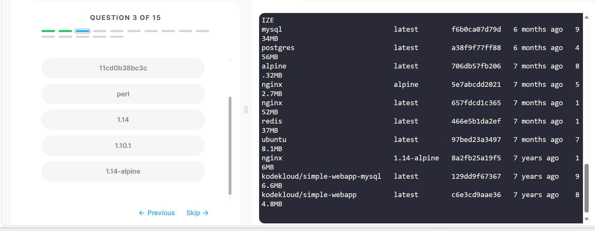
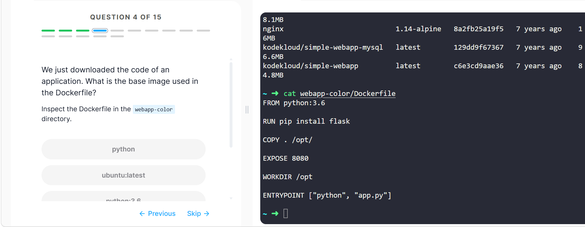
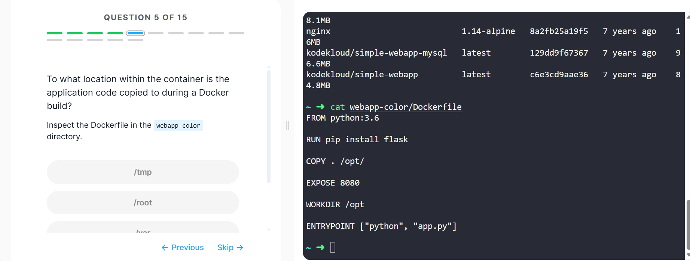
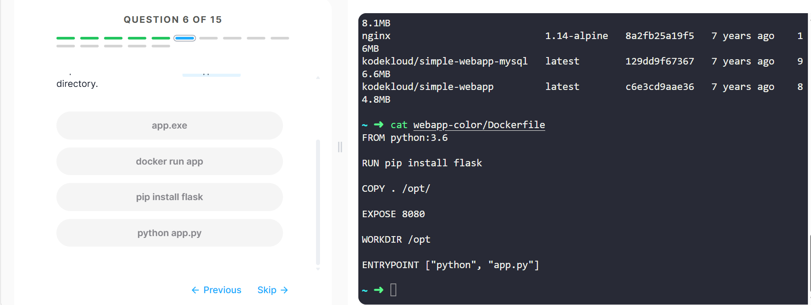
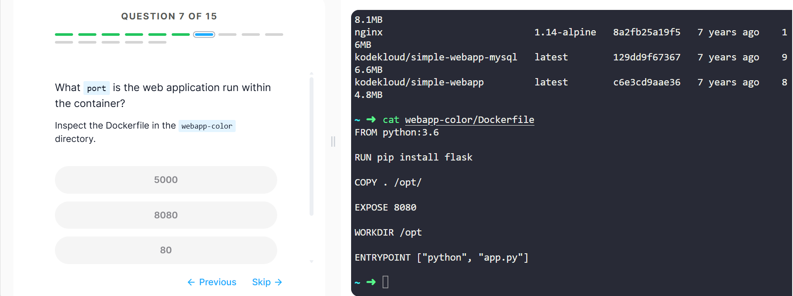
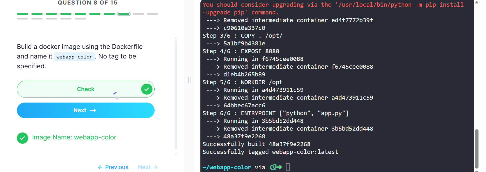
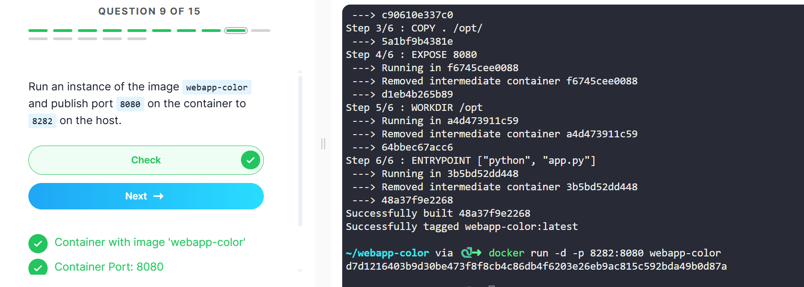

# Docker Images Lab Report

## Introduction
- The aim of this lab was to learn about Docker images and their operations like pulling images, inspecting images, building images, and running images as containers. In the lab, I learnt how to use various Docker commands for tasks such as pulling images and inspecting images.

## Objectives
- Docker Image Pull & Inspection 
- Identification of image tag, size, base os 
- Creation of your own Docker image using Dockerfile
- Image optimization by use of minimalistic base image 
- Launching container and port mapping on Host
- Image versioning and tagging

## Lab Tasks and Commands
### Step1 : 
- Check available images

### Step2: 
- Find Ubuntu image size

### Step3 : 
- Identify NGINX tag

### Step4:
- Inspect Dockerfile (webapp-color)

### step5:
- Build Docker image

### Step6:
- Run container and expose port

### Step7:
- Check Python base OS

### Step8:
- Build lightweight image

### Step9:
- Run lightweight container

## Challenges
- Missing Dockerfile when building an image from an incorrect location
- Learning about proper port mapping (container versus host)
- Determining the right base image for performance improvements
- Difference between image name and repository name
- Keeping the light image within the required limit

## What I Learned
- Structure and storage of Docker images
- Significance of tags for version control in Docker images
- How to determine image size and operating system used
- How to create your own images through Dockerfile
- Use of Alpine images to minimize container size
- Working of port mapping to connect externally to containers
- Common methods to debug Docker problems

## Conclusion
- This lab enabled me to gain insight into the full life cycle of docker images from downloading to inspection of images and building and optimizing my own docker image. This lab also provided an insight on containerization and running of docker container with port mapping and base images.